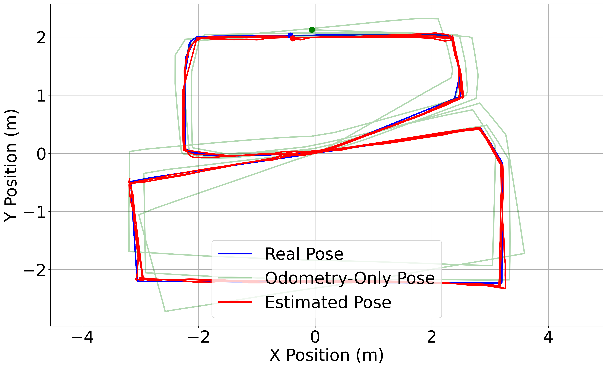
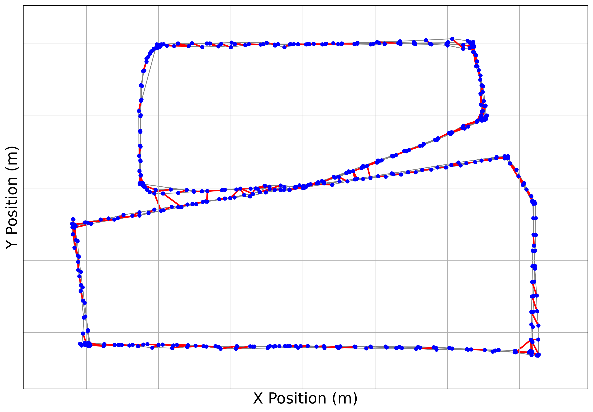
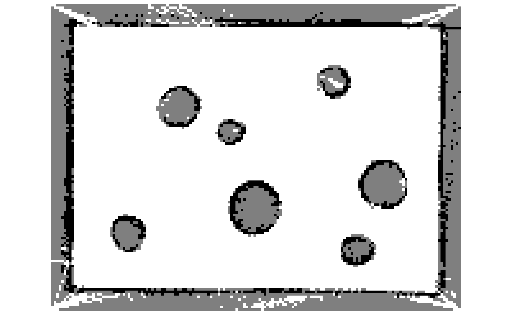
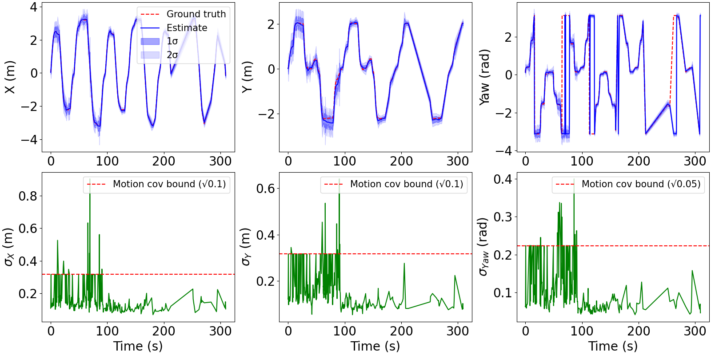

# Scan-SLAM

A ROS 2 (Jazzy) educational Scan-SLAM project with:

- A **frontend** based on correlative scan matching + keyframe management.
- A **backend** based on iterative pose-graph optimization.
- A lightweight 2D robot simulator, plotting/analysis nodes, and logging scripts.

---

## Video and Paper
The presentation on Scan SLAM can be found here: [https://youtu.be/roFVnoGwXZs](https://youtu.be/roFVnoGwXZs)

The paper on Scan SLAM can be found here: [https://github.com/James-Wade1/portfolio/blob/main/assets/files/projects/scan_slam/Scan_SLAM.pdf](https://github.com/James-Wade1/portfolio/blob/main/assets/files/projects/scan_slam/Scan_SLAM.pdf)

## Main References (Frontend + Backend)

This project’s SLAM implementation is primarily based on the following two papers:

1. **Frontend (scan matching):**
	 E. B. Olson, “Real-time correlative scan matching,” in *2009 IEEE International Conference on Robotics and Automation (ICRA)*, 2009, pp. 4387–4393.

2. **Backend (pose-graph optimization):**
	 G. Grisetti, R. Kümmerle, C. Stachniss, and W. Burgard, “A tutorial on graph-based SLAM,” *IEEE Intelligent Transportation Systems Magazine*, vol. 2, no. 4, pp. 31–43, 2010/2011.

---

## Workspace Layout

```text
Scan-SLAM/
├── compose.sh                    # Convenience script to bring Docker up/down
├── docker_scan_slam/             # Dockerfile, compose file, and entrypoint
├── results/                      # Saved media, timing logs, trajectories, analysis scripts
└── src/
		├── scan_slam/                # Core C++ frontend/backend SLAM package
		├── scan_slam_msgs/           # Custom ROS interfaces (PoseGraph, KeyFrame, Constraint)
		├── scan_slam_sim/            # Python simulation and odometry/cmd_vel utilities
		└── scan_slam_viz/            # Python plotting, occupancy grid, covariance, and loggers
```

---

## Package Structure (Basic)

### `scan_slam` (C++)

Core SLAM package containing the end-to-end estimation pipeline.

- **Frontend node** (`frontend_node`):
	- Subscribes to `/scan` and `/odom`.
	- Builds keyframes and local constraints.
	- Performs loop-closure candidate checks and adds loop constraints.
- **Correlative scan matcher**:
	- Lookup-table-based correlation search over \\((x, y, \theta)\\).
	- Returns best relative motion estimate and covariance/information.
- **Backend optimizer**:
	- Solves pose graph iteratively using dense or sparse linearization.
	- Publishes optimized keyframe poses to the frontend for map correction.

### `scan_slam_msgs`

Custom message definitions that connect frontend, backend, and visualization:

- `Constraint.msg`
- `KeyFrame.msg`
- `PoseGraph.msg`

### `scan_slam_sim` (Python)

Simple simulation/driver package for closed-loop testing:

- `robot_sim`: generates simulated robot + scan environment.
- `odom_publisher`: publishes odometry.
- `cmd_vel_pub`: publishes velocity commands for robot motion.

### `scan_slam_viz` (Python)

Visualization and experiment logging tools:

- Odometry drift plotting
- Pose graph plotting
- Occupancy grid rendering
- Pose covariance analysis
- Trajectory and timing logging

---

## Quick Start

### Option A: Docker (recommended)

From repository root:

```bash
./compose.sh up
docker exec -it scan_slam bash
```

Inside the container:

```bash
cd /home/user/ros_ws
source /opt/ros/jazzy/setup.bash
source install/setup.bash
ros2 launch scan_slam scan_slam.launch.py
```

Stop container:

```bash
./compose.sh down
```

### Option B: Native ROS 2 workspace

```bash
source /opt/ros/jazzy/setup.bash
colcon build --symlink-install
source install/setup.bash
ros2 launch scan_slam scan_slam.launch.py
```

---

## Results

### Figures

Estimated vs. ground-truth trajectory:



Pose graph structure:



Occupancy grid estimate:



Pose uncertainty analysis:



### Embedded videos

Odometry drift demo:

<video src="results/media/odometry_drift.mp4" controls width="900"></video>

Full SLAM demo (4x speed):

<video src="results/media/full_demo_4x.mp4" controls width="900"></video>

If your Markdown viewer does not render embedded video, use direct links:

- [Odometry drift video](results/media/odometry_drift.mp4)
- [Full demo 4x video](results/media/full_demo_4x.mp4)

---

## Reproducing analysis outputs

- Trajectory ATE evaluation script: `results/trajectories/compute_ate.py`
- Occupancy-grid analysis script: `results/occupancy_grid/occupancy_grid_analysis.py`
- Timing plots/statistics script: `results/timing/plot_timing.py`
